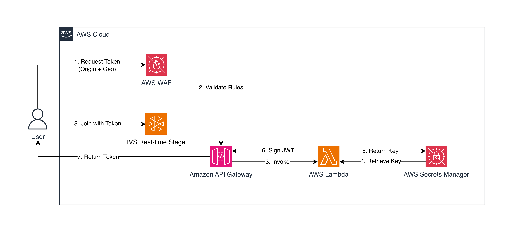

# Secure Token Generation for Amazon IVS Real-Time Streaming

A serverless solution for generating Amazon IVS Real-Time Streaming participant tokens using key-based JWT signing with AWS WAF security controls.

## Overview

This solution implements a secure token generation system that restricts token grants through AWS WAF protection and provides fine-grained token control through key-based JWT signing. The key-based approach gives you complete control over your token schema—allowing you to customize claims, set granular TTL policies, add custom attributes, and implement business-specific authorization rules.

## Architecture



The solution implements a secure token generation flow with multiple security layers:

### Security Layers

1. **WAF**: Restricts token requests using geo-blocking and origin validation
2. **TTL Controls**: Customizable token validity periods limit how long tokens remain valid
3. **Secrets Manager**: Encrypted private key storage with IAM access control
4. **Token Signatures**: Amazon IVS Real-Time Streaming validates token signatures to ensure authenticity

## Quick Start

### Prerequisites

- AWS account with permissions for Lambda, API Gateway, WAF, Secrets Manager
- Amazon IVS Real-Time Streaming stage
- Node.js 20.x

### 1. Create or Import a Key Pair

You need to generate a public/private key pair to sign the JWTs. Amazon IVS uses the public key to verify the tokens at the time of stage join.

**Option A: Create with the Console (Recommended)**

1. Open the Amazon IVS console and choose your stage's region
2. In the left navigation menu, choose **Real-time streaming > Public keys**
3. Choose **Create public key**
4. Follow the prompts and choose **Create**

Amazon IVS generates a new key pair. The public key is imported as a public key resource and the private key is immediately made available for download. **Be sure you save the private key; you cannot retrieve it later.**

Save the ARN for CloudFormation deployment (Step 3) and the private key for Secrets Manager setup (Step 4).

For more details, see [Distribute Participant Tokens](https://docs.aws.amazon.com/ivs/latest/RealTimeUserGuide/getting-started-distribute-tokens.html).

**Option B: Create with OpenSSL and Import**

Alternatively, you can generate a key pair locally using OpenSSL and import the public key to Amazon IVS Real-Time Streaming using the AWS CLI.

### 2. Prepare Lambda Package

```bash
cd lambda
npm install --production
zip -r function.zip tokenGenerator.js package.json node_modules/
```

### 3. Deploy CloudFormation Stack

1. Open AWS Console → CloudFormation → Create Stack
2. Upload `infrastructure/template.yaml`
3. Configure parameters:
   - **Stack name**: `ivs-token-generator-key`
   - **StageArn**: Your IVS Stage ARN
   - **PublicKeyArn**: ARN from step 1
   - **AllowedOrigins**: `http://localhost:3000`
   - **AllowedCountry**: `HK`
4. Acknowledge IAM resource creation
5. Submit (takes ~2-3 minutes)

### 4. Set Private Key in Secrets Manager

After the CloudFormation stack is created, manually populate the private key:

1. Open AWS Console → Secrets Manager
2. Find and click on secret `ivs-realtime-private-key`
3. Click **Retrieve secret value** → **Edit**
4. Replace the placeholder text with your private key from step 1:
   - If using Console-generated key: Paste the entire `privateKeyMaterial` content
   - If using OpenSSL: Paste the entire contents of `priv.pem` file
   - Make sure to include the PEM header and footer lines
5. Click **Save**

### 5. Upload Lambda Code

1. Go to Lambda Console → `IVSTokenGeneratorKey`
2. Upload from → .zip file → Select `function.zip`
3. Save

### 6. Get API Endpoint

CloudFormation → Stack → Outputs tab → Copy `ApiEndpoint`

### 7. Update Player

Edit `player/player.js` line 27 and replace the API endpoint with your actual endpoint from Step 6:

```javascript
const API_ENDPOINT = 'https://xxxxxxxxxx.execute-api.us-east-1.amazonaws.com/prod/token';
```

### 8. Run Player Locally

Start a local web server to serve the player using Node.js:

```bash
cd player
npx http-server -p 3000
```

Open your browser and navigate to `http://localhost:3000/player.html`

### 9. Test Token Generation

1. Click the **Join Stage** button in the player
2. The player will automatically:
   - Fetch a token from your API Gateway endpoint
   - Pass the Origin header (`http://localhost:3000`)
   - Request will be validated by WAF (country and origin check)
   - If successful, join the Amazon IVS Real-Time Streaming stage

Check browser console for any errors.

### 10. Verify Security Controls

**Test 1: Geo-blocking**

Use a VPN to connect from a different country (not HK or your configured country):
1. Connect VPN to a different country
2. Refresh the player page
3. Click **Join Stage**
4. Expected: Request blocked with 403 Forbidden (check browser console)

**Test 2: Origin validation**

Temporarily change `AllowedOrigins` in CloudFormation to a different origin (e.g., `http://localhost:8000`):
1. Update the CloudFormation stack
2. Try to join from `http://localhost:3000`
3. Expected: Request blocked with 403 Forbidden

**Test 3: Check WAF metrics**

1. AWS Console → WAF → Web ACLs → `IVSTokenAPIKeyWebACL`
2. View metrics showing allowed and blocked requests

## Configuration

### Change Allowed Country

Update CloudFormation parameter `AllowedCountry` to a different country code:
```
US  (United States)
HK  (Hong Kong)
GB  (United Kingdom)
SG  (Singapore)
```

### Add More Origins

Update CloudFormation parameter `AllowedOrigins`:
```
http://localhost:3000,http://localhost:8000,https://yourdomain.com
```

### Change Token Expiration

Edit `lambda/tokenGenerator.js` line 105:

```javascript
exp: now + 5,  // 5 seconds (current)
// Change to:
exp: now + (30 * 60),  // 30 minutes
exp: now + (60 * 60),  // 1 hour
```

Redeploy Lambda after changes.

## Monitoring

- **Lambda logs**: CloudWatch → `/aws/lambda/IVSTokenGeneratorKey`
- **WAF metrics**: WAF Console → Web ACLs → `IVSTokenAPIKeyWebACL`
- **API Gateway**: CloudWatch → API Gateway metrics

## Troubleshooting

| Issue | Solution |
|-------|----------|
| 403 Forbidden | Check origin header and verify request is from allowed country |
| 500 Error | Check Lambda CloudWatch logs |
| Invalid signature | Verify key format is correct (PEM format with proper headers) |
| Token expired | Token TTL is 5 seconds by default, regenerate or increase |

## Clean Up

CloudFormation Console → Select stack → Delete

This removes all resources: Lambda, API Gateway, WAF, Secrets Manager, IAM roles.

## Resources

- [Amazon IVS Real-Time Streaming User Guide](https://docs.aws.amazon.com/ivs/latest/RealTimeUserGuide/)
- [Distribute Participant Tokens](https://docs.aws.amazon.com/ivs/latest/RealTimeUserGuide/getting-started-distribute-tokens.html)
- [AWS WAF Developer Guide](https://docs.aws.amazon.com/waf/latest/developerguide/)

## License

This project is licensed under the MIT License.
